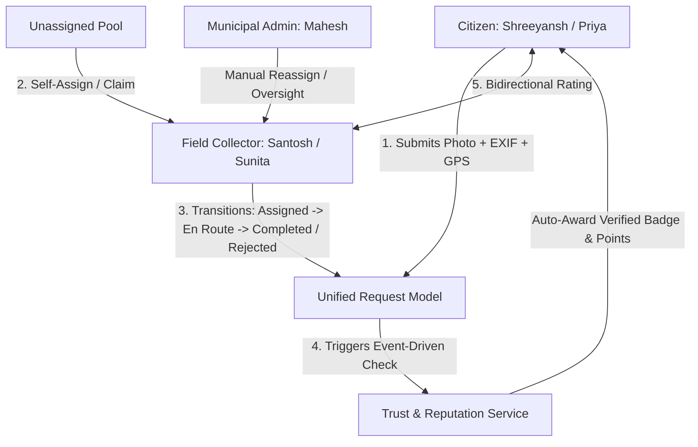

# SwachhSetu • Pune Municipal Corporation (PMC)

> **Official Municipal Enterprise Deployment • SWM 2016 Compliant**  
> *A trust-first, gamified waste collection platform connecting citizens, collectors, and municipal administrators with an end-to-end verification loop and behavioral rewards.*  
> Built strictly adhering to the Apple-inspired design aesthetic in [`Design.md`](./Design.md). Optimized for **Vercel** serverless deployment with a **Supabase (Cloud PostgreSQL)** production database.

---

## The Core Vision: The Trust Layer for Municipal Waste
Standard municipal waste applications behave as simple "request trackers," resulting in severe operational bottlenecks: high volumes of fake requests, unsegregated trash curbside, driver fuel waste, and low long-term citizen recycling adherence.

SwachhSetu introduces an **active Trust & Integrity Loop**:
1. **Submission-Time Integrity**: Photo verification required + camera EXIF presence extraction + GPS geo-matching + dynamic 5-request rate-limiting.
2. **Curbside Collector Verification**: Physical verification by municipal drivers upon arrival; requests with discrepancies are rejected with explicit reasons (`No waste found`, `Duplicate`, `Fake request`).
3. **Bidirectional Accountability**: Citizens and collectors rate each other on every completed pickup, recorded directly against the same request record.
4. **Automated Verified Citizen Badge**: Citizens who maintain 5+ completed pickups with zero rejections are automatically awarded the **Verified Citizen Badge**.
5. **Gamification & Behavioral Rewards**: Points engine (+50 pts/pickup), calendar-week streak counter, and multi-tier achievement badges.
6. **Education**: Interactive, 6-category **Waste Sorting Guide** detailing what belongs, what doesn't, and contamination avoidance protocols.

---

## The 5 Demoable USPs

| USP | Implementation & Where to See It |
|---|---|
| **1. Gamification Engine** | **User Profile Card & Badges Showcase**: Real-time points balance, weekly streak tracker, and a 4-tier badge system (`Harit Punekar`, `Paryavaran Rakshak`, `Swachhata Doot`, `Shunya Kachra Leader`) with live progress bars. |
| **2. Bidirectional Feedback** | **Request Cards & Modals**: When a pickup reaches `Completed`, the collector is prompted to rate the citizen (1-5 stars + segregation comment), and the citizen can rate the collector's service. Both reviews live on the same request record. |
| **3. Verified Citizen Badge** | **Profile & Directory Headers**: Visibly displayed as a blue shield badge (`Verified Citizen`) next to reliable citizens (e.g. Shreeyansh Mahamuni). Auto-awarded at 5+ clean pickups, auto-revoked if a rejection occurs. |
| **4. Fraud Mitigation & Audit** | **Admin Dashboard & Request Details**: Real-time EXIF camera detection, GPS geo-matching badge, 5-request rate-limit lock, and flagged account panel surfacing users with > 2 rejections for human audit. |
| **5. Waste Sorting Guide** | **Waste Guide Tab**: Interactive educational portal covering all 6 categories (`Organic`, `Plastic`, `Paper`, `E-Waste`, `Medical`, `Other`) with clear "What Belongs" vs "What Does NOT Belong" rules. |

---

## Three Roles, One Unified Data Model

The platform provides dedicated, tailored workspaces for all three personas without duplicating business logic:



1. **Citizen User** (`Shreeyansh Mahamuni` / `Priya Deshmukh` / `Rohan Shinde`):
   - Category selector chips, pickup address/date, photo upload with live EXIF preview.
   - 5-request rate-limit safeguard against request spamming.
   - Request lifecycle vertical stepper (`Submitted` -> `Assigned` -> `On the Way` -> `Completed` / `Rejected`).
   - Profile with streak tracker, points balance, and badge collection.
2. **Field Collector** (`Santosh Shinde` / `Sunita Kamble`):
   - Active task management with 1-click status transitions (`Assigned` -> `On the Way` -> `Completed`).
   - Claiming unassigned pickups from the municipal dispatch pool.
   - Curbside rejection protocol requiring standard reason selection.
   - Post-completion citizen rating prompt.
3. **Municipal Admin** (`Mahesh Gokhale`):
   - Master directory with multi-field search and filters (category, status, date range).
   - Real-time fleet metrics (total pickups, completed collections, overall rejection rate %).
   - Manual collector reassignment modal.
   - Flagged Citizen Accounts panel (surfacing accounts with > 2 rejections for audit).
   - Detailed per-user collection & rejection audit table.

---

## Design System Compliance ([Design.md](./Design.md))

The interface strictly reflects the Apple-inspired design language specified in `Design.md`:
- **Color Palette**:
  - `primary`: `#0066cc` (Action Blue - the single brand interactive color).
  - `canvas`: `#ffffff` (Pure White).
  - `canvas-parchment`: `#f5f5f7` (Signature parchment background).
  - `surface-tile-1`: `#272729` (Near-black tile surface).
  - `surface-black`: `#000000` (Pure black reserved for 44px global nav).
  - `ink`: `#1d1d1f` (Typography and headline voice).
- **Typography**: SF Pro / Inter typography scale (`56px` display to `17px` body at `1.47` leading) with negative letter-spacing for the signature tight headline feel.
- **Button Grammar**:
  - `btn-primary`: Full capsule pill (`rounded-pill`, `#0066cc`, white text, `scale(0.95)` press micro-interaction).
  - `btn-secondary-pill`: Transparent background, Action Blue text, 1px border.
  - `btn-pearl-capsule`: `#fafafc` pearl capsule with subtle border.
- **Shadow Philosophy**: Zero decorative drop shadows on cards, buttons, or text. Exactly one soft shadow (`0 3px 30px 0 rgba(0, 0, 0, 0.22)`) reserved strictly for photographic waste imagery resting on a surface.

---

## Tech Stack & Cloud Architecture

- **Frontend**: React 18, Vite, TypeScript, TailwindCSS (with custom `Design.md` design tokens), Lucide React.
- **Backend API**: Node.js, Express, TypeScript, Multer (in-memory buffer), `exifr` (EXIF camera metadata & GPS parser).
- **Serverless Entrypoint**: `api/index.ts` natively executed via Vercel Serverless Functions.
- **Database Layer**:
  - **Production (Vercel)**: **Supabase (PostgreSQL)** via `@supabase/supabase-js`.
  - **Local Fallback**: SQLite (`smartwaste.db`) when running offline or without credentials.
  - **Schema & Seed**: Ready-to-run [`supabase_schema.sql`](./supabase_schema.sql) for 1-click database setup.
- **Deployment Platform**: Vercel (Edge CDN + Serverless Functions via [`vercel.json`](./vercel.json)).

---

## Quickstart & Local Setup

### Prerequisites
- Node.js 18+ and npm installed

### 1. Installation
```bash
# Clone the repository
git clone https://github.com/YOUR_USERNAME/swachhsetu.git
cd swachhsetu

# Install dependencies for server and client
npm run install:all
```

### 2. Run in Development Mode
```bash
# Run backend (in terminal 1):
npm run dev:server

# Run frontend (in terminal 2):
npm run dev:client
```
*Frontend runs at `http://localhost:5173` with automatic API proxying to backend on port 8080.*

### 3. Run Production Build (Single Unified Port 8080)
```bash
# Build both Vite frontend and TypeScript backend
npm run build

# Start production server
npm start
```
Open **`http://localhost:8080`** in your browser.

---

## Deploying to Vercel with Supabase

Full walkthrough available in [**`VERCEL_DEPLOYMENT.md`**](./VERCEL_DEPLOYMENT.md).

**Quick Summary (3 minutes)**:
1. Create a free project on [Supabase](https://supabase.com).
2. In Supabase **SQL Editor**, paste and run [`supabase_schema.sql`](./supabase_schema.sql).
3. Push this repo to GitHub.
4. Import project in [Vercel](https://vercel.com) and set Environment Variables:
   - `SUPABASE_URL` = `https://your-project.supabase.co`
   - `SUPABASE_KEY` = `your-anon-or-service-role-key`
5. Click **Deploy**!

---

## Verified Demo Personas

Use the **Switch Account** selector in the top navigation bar to immediately evaluate any persona:

1. **Shreeyansh Mahamuni (`user_shreeyansh`) - Model Punekar**:
   - **5 Completed pickups**, 0 rejections -> **Verified Citizen Badge earned**.
   - 350 points, 3-week streak, 3 unlocked badges (`Harit Punekar`, `Paryavaran Rakshak`, `Swachhata Doot`).
   - Located in **Mayur Vihar, Paud Road, Kothrud, Pune - 411038**.
2. **Priya Deshmukh (`user_priya`) - Active Beginner**:
   - 1 Completed pickup, 1 Assigned pickup -> Harit Punekar badge, 100 points, 2-week streak.
   - Located in **Rohan Mithila, Viman Nagar, Pune - 411014**.
3. **Rohan Shinde (`user_rohan`) - Flagged Offender**:
   - **3 Rejected requests** (`No waste found outside society gate`, `Fake photo downloaded from internet`, `Duplicate request`).
   - Located in **Magarpatta Road, Hadapsar, Pune - 411028**. Displays prominent **High Rejection Flag** warning.
4. **Santosh Shinde (`collector_santosh`) & Sunita Kamble (`collector_sunita`) - PMC / SWaCH Field Collectors**:
   - Active tasks in Kothrud, Aundh, and Baner, pool claiming, status progression buttons, curbside rejection modal, and citizen rating prompt.
5. **Mahesh Gokhale (`admin_mahesh`) - PMC Solid Waste Management Officer**:
   - Master request table with search & date filtering, collector reassignment, fleet statistics, and fraud mitigation console.
